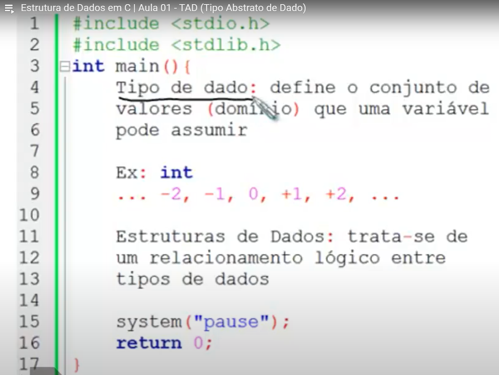
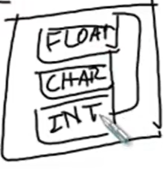
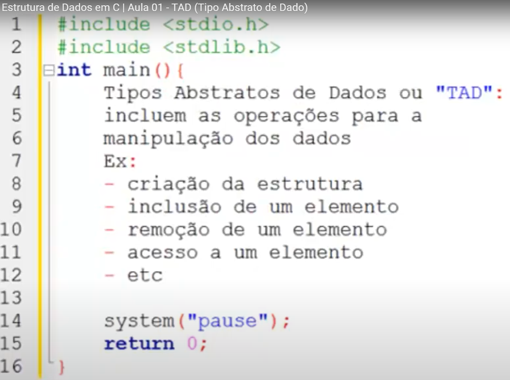
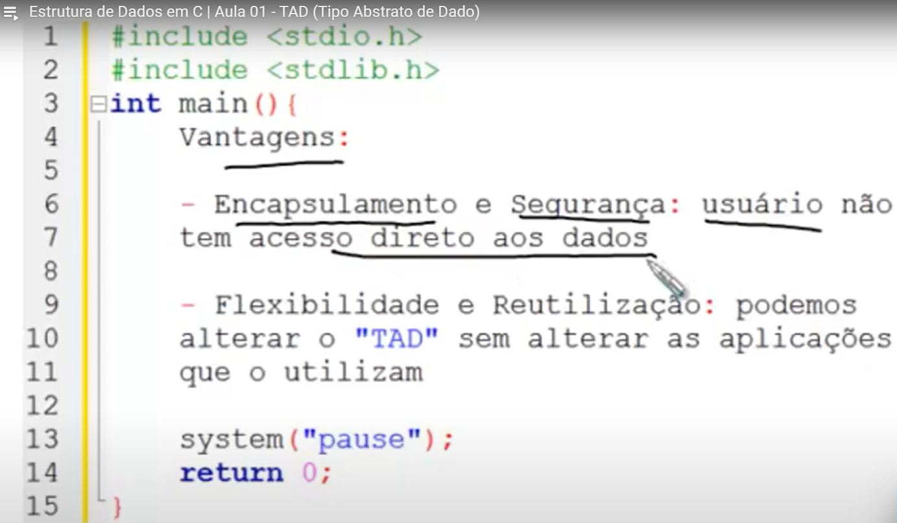
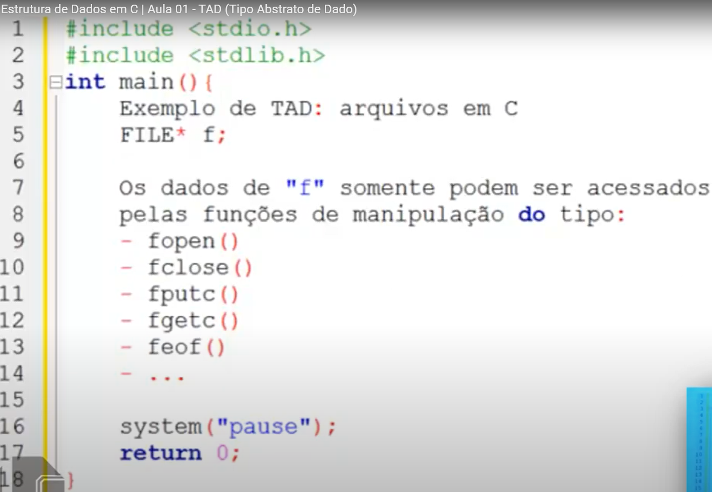

## Estrutura de Dados em C | Aula 01 - TAD (Tipo Abstrato de Dado)

A aula introduz conceitos de estrutura de dados em C, focando em tipos abstratos de dados (TAD), explicando a importância do encapsulamento e segurança, e exemplificando com ponteiros para arquivos.
Detailed Summary for [Estrutura de Dados em C | Aula 01 - TAD (Tipo Abstrato de Dado)](https://www.youtube.com/watch?v=bryesHll0vY&list=PL8iN9FQ7_jt6H5m4Gm0H89sybzR9yaaka&index=1&ab_channel=Programa%C3%A7%C3%A3oDescomplicada%7CLinguagemC) by [Monica](https://monica.im)

  [00:06](https://www.youtube.com/watch?v=bryesHll0vY&list=PL8iN9FQ7_jt6H5m4Gm0H89sybzR9yaaka&index=1&ab_channel=Programa%C3%A7%C3%A3oDescomplicada%7CLinguagemC&t=6.952) Introdução à Estrutura de Dados em C e Tipo Abstrato de Dados (TAD)

  

  - Conceitos iniciais sobre estrutura de dados e linguagem C}
- Definição de tipo de dado e seu domínio de valores}
- Exemplo prático com variável inteira (int) e seu intervalo de valores}
- Relacionamento lógico entre tipos de dados através de estruturas de dados (structs)}
      
[01:35](https://www.youtube.com/watch?v=bryesHll0vY&list=PL8iN9FQ7_jt6H5m4Gm0H89sybzR9yaaka&index=1&ab_channel=Programa%C3%A7%C3%A3oDescomplicada%7CLinguagemC&t=95.46) Introdução ao Tipo Abstrato de Dados (TAD)
  - Definição de estrutura de dados com exemplo de vetor de char, int e float}
   
- Explicação do conceito de Tipo Abstrato de Dado (TAD)}

- Operações básicas em um TAD: criação, inclusão e remoção de elementos}
- Vantagens do TAD: encapsulamento, segurança, flexibilidade e reutilização dos dados}

      
[03:06](https://www.youtube.com/watch?v=bryesHll0vY&list=PL8iN9FQ7_jt6H5m4Gm0H89sybzR9yaaka&index=1&ab_channel=Programa%C3%A7%C3%A3oDescomplicada%7CLinguagemC&t=186.915) Tipo Abstrato de Dados (TAD) permite a manipulação de dados sem acesso direto aos detalhes internos
  - Implementação separada da TAD não afeta o uso das aplicações}
- Exemplo de TAD: ponteiro para um arquivo (FILE* f)}
- Manipulação de arquivos através das funções fopen, fclose, fputc e fgetc}
- Acesso aos dados apenas por meio das funções definidas para o tipo abstrato}

      