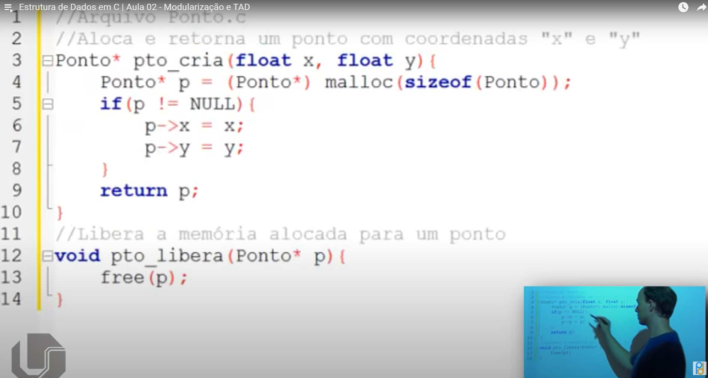
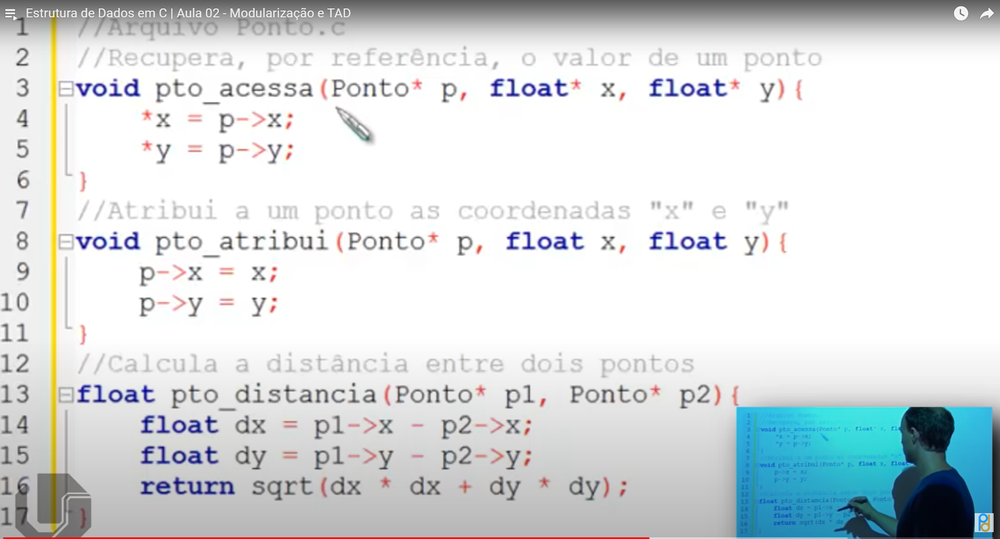
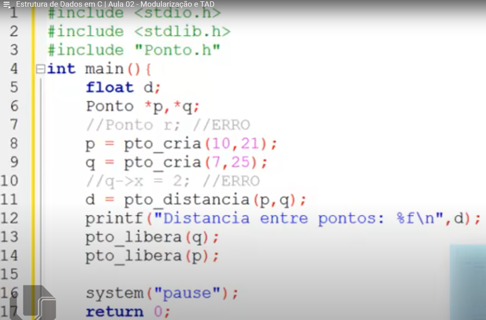

## Estrutura de Dados em C | Aula 02 - Modularização e TAD

A aula aborda a modularização e a implementação de Tipos Abstratos de Dados (TAD) em C, utilizando arquivos .h e .c para separar definição e implementação, exemplificando com a criação de uma estrutura de ponto e funções associadas.
Detailed Summary for [Estrutura de Dados em C | Aula 02 - Modularização e TAD](https://www.youtube.com/watch?v=lKwEQgV6nZk&list=PL8iN9FQ7_jt6H5m4Gm0H89sybzR9yaaka&index=2&ab_channel=Programa%C3%A7%C3%A3oDescomplicada%7CLinguagemC) by [Monica](https://monica.im)

  [00:06](https://www.youtube.com/watch?v=lKwEQgV6nZk&list=PL8iN9FQ7_jt6H5m4Gm0H89sybzR9yaaka&index=2&ab_channel=Programa%C3%A7%C3%A3oDescomplicada%7CLinguagemC&t=6.897) Implementação de um Tipo Abstrato de Dados em C através da modularização e uso de arquivos .h e .c
  - Importância da modularização na criação de um TAD em C}
- Convenção de uso de arquivos .h para protótipos de funções e tipos de ponteiros}
- Criação de arquivo .c para implementação das funções do TAD}
- Ocultação dos dados do usuário através do acesso apenas por meio das funções}
- Exemplo prático de criação de um TAD para um ponto definido pelas coordenadas X e Y}
      
[02:35](https://www.youtube.com/watch?v=lKwEQgV6nZk&list=PL8iN9FQ7_jt6H5m4Gm0H89sybzR9yaaka&index=2&ab_channel=Programa%C3%A7%C3%A3oDescomplicada%7CLinguagemC&t=155.385) Definição de tipos de dados e funções em C para manipulação de uma estrutura ponto
  - Definição do tipo de ponteiro para a estrutura ponto}
- Criação de funções para manipulação dos dados da estrutura ponto}
- Explicação das funções: criação, liberação, acesso e cálculo de distância de pontos}
- Descrição da função de cálculo de distância entre dois pontos}
- Definição da estrutura de dados struct ponto no arquivo .h e implementação das funções no arquivo .c}
      
[05:00](https://www.youtube.com/watch?v=lKwEQgV6nZk&list=PL8iN9FQ7_jt6H5m4Gm0H89sybzR9yaaka&index=2&ab_channel=Programa%C3%A7%C3%A3oDescomplicada%7CLinguagemC&t=300.082) Implementação das funções em C para criar e manipular pontos


  - Início da implementação da função de criar um ponto com alocação dinâmica de memória}
- Atribuição dos valores de x e y dentro da estrutura do ponto}
- Explicação sobre a liberação de memória do ponto utilizando a função free}
- Necessidade de passar valores por referência em funções para retornar mais de um valor}
    ```
    //Linguagem C: arquivo.c
    //Aloca e retorna um ponto com coordenadas "x" e "y".
    Ponto* pto_cria (float x float y){
        Ponto* p = (Ponto*) malloc (sizeof(Ponto));
        if (p != NULL){
            p->x = x;
            p->y = y;
        }
        return p;
    }
    //Libera a memória alocada para um ponto.
    void pto_libera(Ponto* p){
        free(p);
    }
    ```
    
      
[07:33](https://www.youtube.com/watch?v=lKwEQgV6nZk&list=PL8iN9FQ7_jt6H5m4Gm0H89sybzR9yaaka&index=2&ab_channel=Programa%C3%A7%C3%A3oDescomplicada%7CLinguagemC&t=453.149) Criação e utilização de uma biblioteca em C para calcular a distância entre dois pontos



  - Armazenamento dos valores passados por parâmetro em uma estrutura}
- Finalização do cálculo da distância entre os pontos}
- Declaração e atribuição de coordenadas aos pontos p e q}
- Chamada da função de cálculo da distância e impressão do resultado}
      