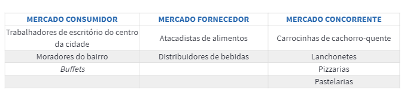

## O Mercado

A palavra mercado é muitíssimo utilizada no ramo dos negócios. Mas, afinal, o que ela significa?

Mercado é o “local” onde ocorrem as relações entre a oferta e a procura de produtos e serviços, através de vendedores e compradores, de tal forma que ocorra a transferência de propriedade da mercadoria por meio de operações de compra e  venda. O mercado tende a equilibrar-se por essa lei de oferta e de procura. Funciona ao agrupar muitos vendedores interessados, e ao facilitar que os potenciais compradores os encontrem. Ou seja, uma economia que depende sobretudo das interações entre compradores e vendedores. 

Mas do que ele é constituído? E como é formado esse mercado?

Essas são perguntas que você, como um futuro empreendedor, pode estar se fazendo.
___

## Momento de Reflexão
>Questionamentos para que a abertura do negócio fosse bem fundamentada: 

1. _Vocês realizaram um estudo de mercado?_ 

2. _Conheceram a concorrência?_ 

3. _O estudo foi suficiente para conhecer o perfil dos clientes?_

4. _São pessoas físicas ou jurídicas?_

5. _Identificaram as necessidades desses clientes?_ 

6. _E seus desejos?_

Essas questões são essenciais para um empreendedor antes de iniciar o seu negócio.

## Ferramentas para compreender as NECESSIDADES do mercado.

São duas: 

1. **Pesquisa de Mercado:** 
   A pesquisa de mercado é o momento em que o empreendedor irá reunir informações junto aos clientes, concorrentes e fornecedores sobre seus produtos e sobre o contexto em que estão inseridos.

    No caso do Francisco e da Neide, o qual você acompanhou no Tópico 1, a pesquisa de mercado deve ser feita para evitar três situações. Clique nos números para conhecê-las.
    **Pesquisa de mercado**
    * **Tópico 1:** Perda dos clientes atuais.

       Como já possuem um negócio aberto, é necessário conhecer os clientes atuais e fidelizá-los aos produtos já comercializados.

    * **Tópico 2:** Risco de não terem fornecedores.
  
       Não tendo uma pesquisa em mãos, as percepções deles estavam distorcidas em relação à realidade.

  
    * **Tópico 3:** Possibilidade de efetivamente montarem o negócio.
  
         Um ponto importante é ficar atento à concorrência, fazer a pesquisa iria lhes abrir os olhos a respeito disso e eles poderiam agir a partir das informações que obteriam através dela.

    Estes três motivos, determinam exatamente o que a empresa irá comercializar e toda estrutura necessária para que ela possa entrar no mercado, oferecendo exatamente o que os clientes querem e como eles querem.

    ## Estrutura do Mercado

    1. _**Mercado consumidor:**_ São as pessoas que têm o poder de compra. Ao analisar o mercado consumidor, é possível identificar um perfil predominante, considerando sexo, gênero, classe social, idade, nível de escolaridade etc. Analisando esse perfil, você identifica hábitos e comportamentos do público-alvo.
   
    2. _**Mercado fornecedor:**_ São as empresas e as pessoas que fornecem insumos (produtos ou serviços) para o seu negócio. Ao identificar seus fornecedores e possíveis substitutos, é possível, por exemplo, facilitar negociações, obter entregas adequadas e garantir melhor pontualidade.
   
    3. _**Mercado concorrente:**_ São as pessoas ou as empresas acessíveis, que oferecem produtos e serviços similares para o mesmo público-alvo. Sobre o mercado concorrente, é importante ter posição competitiva, que é a capacidade de conseguir melhores negociações junto aos fornecedores e ao público-alvo; além de conhecer os métodos de operação das demais empresas, podendo aprimorar o seu próprio negócio e ser mais competitivo.
   
   ## Identificação de novas oportunidades
   
    Após conhecer o mercado consumidor, fornecedor e concorrente, você poderá identificar novas oportunidades de negócio, pois os aspectos destes mercados influenciam nas decisões de compra dos consumidores. Também é possível saber onde explorar e como direcionar o seu negócio para atingir as necessidades e os desejos dos consumidores.

    O conhecimento dos anseios do consumidor é importante, pois determina exatamente o que a empresa irá comercializar e toda estrutura necessária para que possa entrar no mercado, oferecendo exatamente o que querem e como querem os clientes.

    
Viu só a importância da pesquisa e do conhecimento acerca da estrutura do mercado?

_Anote:_ 

_A necessidade do cliente, em alguns momentos, já existe e precisa ser identificada; porém, muitas empresas ao lançarem produtos inovadores acabam criando demandas que não existiam anteriormente._

## Dimensionar o mercado

Saber o tamanho do seu mercado permite ter uma ideia aproximada do volume de vendas que sua empresa poderá atingir e, portanto, estimar qual o potencial de lucro que ela realmente tem.

Dimensionar o tamanho do seu mercado é mais simples do que parece. Para fazer isso, serão necessárias três informações diferentes:
Dimensionando o mercado
Número de consumidores da sua área de atuação;
Número de concorrentes na sua área de atuação;
Tíquete médio de sua venda.
É de suma importância aprofundar os conhecimentos sobre pesquisa de mercado. Quanto mais você conhecer o mercado em que deseja atuar maiores serão as chances de você tomar decisões mais precisas e o seu negócio dar certo.

## A pesquisa de mercado
Após conhecer a sistemática da pesquisa de mercado, sua estrutura, seus componentes e as formas de identificar novas oportunidades, é possível chegar a um resultado que pode favorecer os próximos passos para alavancar o seu negócio.
 
Veja abaixo o exemplo do resultado da pesquisa de mercado do Francisco e da Neide.

|**RESULTADO DA PESQUISA** - PERFIL DO CLIENTE|
___
* **Renda** -	Entre 2 e 5 salários mínimos (classe média baixa).
___
* **Local onde reside**	- Periferia.
___
* **O que procura** - Lanche rápido e sadio a custo baixo (quando podem). Não se deslocariam para uma loja distante, mesmo que gostassem muito de determinado produto. O custo de tempo e dinheiro seria alto demais. O importante para eles é a conveniência da compra no local de trabalho.	
___

___
* **Frequência** - Lancham no período da tarde e apenas nos dias de trabalho.
___	
* **Valor que pagaria** - R$5,00 por um salgado e um suco.
___
* **Pontos fortes dos produtos** -	Sucos de frutas frescas, amostras grátis oferecidas para degustação, serviço de entregas, produtos com jeito caseiro e vendas corpo a corpo.
___
* **Concorrência (5 lanchonetes pesquisadas)** - São próximas à empresa de ônibus e aos escritórios do centro. Variedade de produtos e preço similar.

## Momento de reflexão

### Como identificar os pontos fortes dos seus concorrentes 

É essencial para a elaboração de um bom plano de negócio analisar os concorrentes de maneira adequada 

Por onde começar um plano de negócios? 

Respondido por Eduardo Vilas Boas, especialista em plano de negócio.

Conhecer quais são as empresas que estarão no mesmo mercado que você irá atuar e quais são as suas “armas” vai ajudar na definição do seu modelo de negócio e estratégia. Antes de identificar os concorrentes, é preciso entender com clareza quais são as necessidades dos clientes que a empresa pretende atender. Esse é um ponto crucial para descobrir quem serão os seus concorrentes diretos e indiretos. 

Por exemplo, existem diversas empresas que vendem alimentos, cada qual atendendo benefícios específicos do cliente e com mix de marketing diferente. Tanto a padaria quanto o supermercado vendem pães, mas a padaria atende a necessidade do cliente que procura praticidade e qualidade e não necessariamente preço. 

Neste caso, outras padarias são concorrentes diretos e devem ser observadas com mais atenção, enquanto que o supermercado é um concorrente indireto. 

Durante o exercício de entender o cliente e o posicionamento de marketing que a empresa pretende adotar o empreendedor deve identificar o que é importante para o cliente que fará parte do seu mercado-alvo. Entender o que o público-alvo valoriza será importante para identificar o que deve ser analisado mais criteriosamente nos concorrentes. 

Após identificar quem são os concorrentes diretos e indiretos, o empreendedor deve analisar como os concorrentes diretos são nos pontos que ele identificou como sendo os mais importantes para o seu público-alvo. 

Para fazer essa comparação, o empreendedor pode buscar informações secundárias (informações divulgadas na mídia ou em relatórios de mercado sobre as empresas concorrentes e o que elas oferecem), pode buscar informações primárias com clientes (fazer uma pesquisa com pessoas que já consumiram ou que tendem a consumir aquele produto sobre a opinião que tem dos concorrentes no mercado), com fornecedores e até mesmo visitar e ter uma experiência de compra nos concorrentes diretos.

Mesmo após terminado o plano de negócios e iniciado o empreendimento é importante fazer um monitoramento sistemático dos concorrentes, que com certeza reagirão à sua entrada no mercado de alguma maneira, portanto não adianta achar que a análise dos concorrentes será feita uma única vez. É preciso também ficar atento às empresas que podem vir a ser suas concorrentes no futuro. 

A análise dos concorrentes é importante e deve ajudar o empreendedor a conhecer o mercado e a encontrar a melhor oportunidade para explorar, mas não deixe que ela coloque medo e faça diminuir a força e a vontade para empreender, mesmo em mercados cheios de concorrentes um bom empreendedor poderá achar um espaço e explorar uma oportunidade.

Eduardo Vilas Boas é empreendedor, doutor em administração de empresas pela FEA/USP, sócio da Empreende e criador do site Empreende.vc.
___
## Onde o negócio está inserido
Tabela com detalhamento do mercado em que se encontram.

1. **Estudo de Mercado:** 

