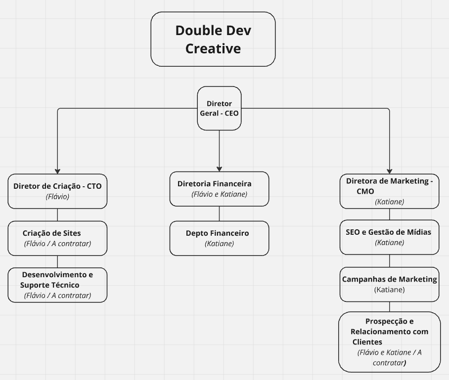

## 1. CEO (Chief Executive Officer) - Flávio
**Responsabilidades:** é responsável pelas decisões estratégicas da agência. Pessoa por trás da direção geral.

## 2. CMO (Chief Marketing Officer) - Katiane
**Responsabilidades:** Katiane, como CMO, é o braço direito do diretor geral. É responsável por cuidar de perto da parte comercial, olhando para as atividades que geram receita, atuando também como líder nas áreas de SEO (Search Engine Optimization) e Gestão de Conteúdo. Ela supervisiona os serviços relacionados a marketing digital e otimização de motores de busca, além de gerenciar o atendimento ao cliente.

**Áreas:** Marketing, SEO, atendimento ao cliente.
## 3. CTO (Chief Technology Officer) - Flávio
**Responsabilidades:** Flávio atua como CTO, liderando o desenvolvimento de tecnologia na agência, especialmente no que se refere à criação de sites responsivos. Ele também supervisiona a implementação técnica de soluções de TI e coordena a equipe de desenvolvimento de sites.

**Áreas:** Desenvolvimento de websites e soluções técnicas.
## 4. CFO (Chief Financial Officer) - Flávio/Katiane
**Responsabilidades:** O CFO, em um papel adicional, poderia ser Katiane ou um futuro terceiro responsável. Ele ou ela gerenciaria as finanças da empresa, cuidando de operações financeiras, orçamentos e escalabilidade dos negócios.

**Áreas:** Gestão financeira e orçamentos.
## 5. Social Media Management - Katiane
**Responsabilidades:** Além de sua função como CEO, Katiane também lidera a gestão de mídias sociais, criando e executando estratégias de conteúdo para maximizar o engajamento nas plataformas de redes sociais dos clientes.

**Áreas:** Gestão de redes sociais, campanhas de marketing digital.
## 6. Website Development - Flávio
**Responsabilidades:** Flávio é o principal desenvolvedor web, responsável por todos os aspectos técnicos relacionados ao desenvolvimento de sites responsivos. Ele garante que os sites sejam adaptáveis a todos os dispositivos e atendam aos padrões modernos de design e funcionalidade.

**Áreas:** Desenvolvimento de sites responsivos, otimização técnica.
## 7. Finance & Operations - Katiane
**Responsabilidades:** Este papel envolve tanto a gestão financeira (já coberta pela CFO) quanto as operações diárias da empresa, desde a manutenção de infraestrutura de trabalho (cloud, software) até a coordenação das entregas de projetos.

**Áreas:** Operações empresariais, infraestrutura tecnológica.
## Resumo da Estrutura:
A agência adota uma estrutura enxuta e ágil típica de uma "Eu-Agência", onde as funções são distribuídas de maneira eficiente entre os dois sócios (Flávio e Katiane). Katiane assume um papel mais amplo de liderança executiva e marketing, enquanto Flávio é responsável pelo lado tecnológico da criação dos sites.

Caso a empresa cresça, o organograma pode expandir com a inclusão de novos membros ou terceirizados para funções de suporte, como atendimento ao cliente, design, e operações financeiras.

Esse modelo gráfico reflete uma estrutura horizontal, com uma comunicação direta entre os sócios, o que favorece a flexibilidade e a rápida tomada de decisões.

___