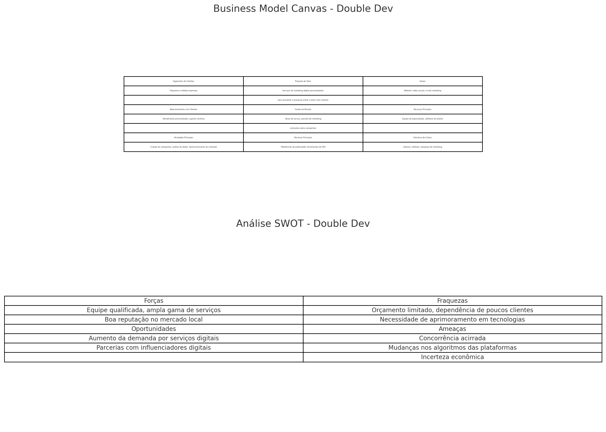

## EXERCÍCIO 01 - "INICIANDO UM NEGÓCIO..."

### QUESTÕES:

> 1. Definam o Negócio.

    Negócio: Uma Agência de Marketing Digital que oferece serviços de criação de conteúdo(Artigos de Blog, Integração com redes sociais, Desenvolvimento de sites, ), gerenciamento de redes sociais, SEO (otimização para motores de busca), campanhas de publicidade online e análise de dados para pequenas e médias empresas.

> 2. Problema/Oportunidade identificada.

    Problema/Oportunidade: Muitas pequenas e médias empresas não têm a expertise ou os recursos necessários para implementar estratégias eficazes de marketing digital, resultando em baixa visibilidade online e perda de oportunidades de crescimento.

> 3. Solução Proposta.

    Solução Proposta: Nossa agência oferece uma solução completa de marketing digital, desde a criação de conteúdo atraente até a implementação de campanhas publicitárias segmentadas e análise de resultados, ajudando as empresas a aumentar sua presença online e atrair mais clientes.

> 4. Como esse problema vem sendo resolvido hoje ?

    Soluções Atuais: Atualmente, as empresas tentam resolver esse problema contratando freelancers, usando ferramentas de marketing DIY (faça você mesmo) ou contratando agências generalistas que não têm um foco específico nas necessidades das pequenas e médias empresas.

> 5. Por que a solução de vocês é a melhor ?

    Diferenciais da Solução: Nossa agência se destaca por oferecer um serviço personalizado, adaptado às necessidades e orçamento de pequenas e médias empresas. Utilizamos as mais recentes ferramentas e técnicas de marketing digital, e fornecemos relatórios detalhados para medir o ROI (retorno sobre investimento) das campanhas.  

> 6. O que vocês precisam saber sobre esse negócio ?

    Informações Essenciais: Precisamos entender melhor o mercado local de pequenas e médias empresas, suas principais dificuldades em marketing digital, e quais canais e estratégias de marketing têm o maior impacto para esses negócios.

> 7. Que habilidades precisam ter para coloca-lo em prática ?
 
    Habilidades Necessárias: Precisamos de habilidades em marketing digital, como SEO, publicidade online, análise de dados, criação de conteúdo, desenvolvedores e gerenciamento de redes sociais. Além disso, habilidades em comunicação e atendimento ao cliente são essenciais para entender e atender às necessidades dos clientes.

### Aplicação do Modelo de Negócio Canvas
Para uma Agência de Marketing Digital, o Modelo de Negócio Canvas pode ser preenchido da seguinte forma:

**1. Proposta de Valor:** Oferecemos soluções personalizadas de marketing digital que ajudam pequenas e médias empresas a crescerem online e aumentarem suas vendas.

**2. Segmento de Clientes/Mercado:** Pequenas e médias empresas que buscam aumentar sua presença online e atrair mais clientes.

**3. Canais:** Website da agência, redes sociais, marketing de conteúdo, publicidade online, eventos e webinars.

**4. Relacionamento com Clientes:** Atendimento personalizado, consultoria contínua, relatórios de desempenho mensais, suporte ao cliente.

**5. Fontes de Receita:** Taxas de serviço, pacotes de marketing, comissões sobre resultados de campanhas publicitárias.

**6. Recursos Chave:** Especialistas em marketing digital, ferramentas de análise e gerenciamento de campanhas, software de criação de conteúdo.

**7. Atividades Chave:** Criação e gestão de campanhas de marketing digital, análise de desempenho, consultoria em marketing, criação de conteúdo.

**8. Parcerias Chave:** Ferramentas de marketing digital (Google Ads, Facebook Ads), plataformas de análise (Google Analytics), freelancers de conteúdo.

**9. Estrutura de Custos:** Salários dos especialistas, custos de ferramentas de marketing, custos de publicidade, infraestrutura (escritório, equipamentos).

___
### Uma agência de marketing digital pode criar uma variedade de conteúdos para atender às necessidades de seus clientes e alcançar os objetivos de suas campanhas. Aqui estão alguns exemplos de conteúdos que uma agência de marketing digital pode criar:

Uma agência de marketing digital pode criar uma variedade de conteúdos para atender às necessidades de seus clientes e alcançar os objetivos de suas campanhas. Aqui estão alguns exemplos de conteúdos que uma agência de marketing digital pode criar:

### 1. **Artigos de Blog**
- **Propósito:** Aumentar o tráfego orgânico, educar o público-alvo e melhorar o SEO.
- **Exemplo:** Artigos informativos, tutoriais, listas e guias sobre temas relevantes ao negócio do cliente.

### 2. **Postagens em Redes Sociais**
- **Propósito:** Engajar o público, aumentar a visibilidade da marca e promover produtos ou serviços.
- **Exemplo:** Postagens no Facebook, Instagram, LinkedIn, Twitter, incluindo imagens, vídeos, carrosséis e stories.

### 3. **Vídeos**
- **Propósito:** Aumentar o engajamento, transmitir mensagens de forma visual e atrativa, e alcançar um público mais amplo.
- **Exemplo:** Vídeos explicativos, tutoriais, depoimentos de clientes, transmissões ao vivo e vídeos promocionais.

### 4. **Infográficos**
- **Propósito:** Comunicar informações complexas de maneira visual e fácil de entender, e aumentar o compartilhamento nas redes sociais.
- **Exemplo:** Infográficos sobre estatísticas do setor, processos ou passos a seguir, e comparações.

### 5. **E-books e Whitepapers**
- **Propósito:** Gerar leads, educar o público em profundidade sobre um tema específico e estabelecer a autoridade da marca.
- **Exemplo:** Guias detalhados, relatórios de pesquisa, estudos de caso e documentos técnicos.

### 6. **Webinars e Palestras Online**
- **Propósito:** Educar o público, gerar leads qualificados e engajar diretamente com a audiência.
- **Exemplo:** Apresentações ao vivo, sessões de perguntas e respostas, workshops e seminários online.

### 7. **E-mails Marketing**
- **Propósito:** Nutrir leads, promover produtos ou serviços, e manter um relacionamento contínuo com os clientes.
- **Exemplo:** Newsletters, e-mails promocionais, e-mails de boas-vindas, e-mails de agradecimento e atualizações de produtos.

### 8. **Anúncios Pagos**
- **Propósito:** Aumentar a visibilidade da marca, promover ofertas e alcançar novos clientes.
- **Exemplo:** Anúncios no Google Ads, Facebook Ads, Instagram Ads, LinkedIn Ads, incluindo texto, imagens e vídeos.

### 9. **Conteúdo para Sites**
- **Propósito:** Melhorar a experiência do usuário, otimizar para SEO e converter visitantes em clientes.
- **Exemplo:** Páginas de produtos/serviços, landing pages, descrições de produtos e páginas institucionais.

### 10. **Podcasts**
- **Propósito:** Alcançar um público que consome conteúdo em formato de áudio e estabelecer uma conexão mais pessoal.
- **Exemplo:** Entrevistas com especialistas, discussões sobre tendências do setor e dicas práticas.

### 11. **Cases de Sucesso**
- **Propósito:** Demonstrar a eficácia dos serviços da agência e construir credibilidade.
- **Exemplo:** Estudos de caso detalhando como a agência ajudou outros clientes a alcançar seus objetivos.

### 12. **Memes e Conteúdo Viral**
- **Propósito:** Aumentar o engajamento e a visibilidade da marca de forma divertida e compartilhável.
- **Exemplo:** Memes relacionados ao setor, desafios virais e postagens humorísticas.

### 13. **Testemunhos e Avaliações de Clientes**
- **Propósito:** Construir confiança e credibilidade para a marca.
- **Exemplo:** Vídeos de depoimentos, citações de clientes em postagens de redes sociais e avaliações em sites.

Esses conteúdos são essenciais para atrair, engajar e converter o público-alvo, ajudando a alcançar os objetivos de marketing dos clientes da agência.

___
### Sobre a Criação de Sites.
A criação de sites pode ser um dos produtos oferecidos por uma agência de marketing digital. Na verdade, é um serviço essencial, pois um site bem projetado e funcional é a base de uma presença online eficaz. Aqui estão alguns aspectos da criação de sites que uma agência pode oferecer:

### Serviços de Criação de Sites

1. **Desenvolvimento de Sites Personalizados**
   - **Descrição:** Criação de sites sob medida para atender às necessidades específicas de cada cliente, incluindo design exclusivo e funcionalidades personalizadas.
   - **Exemplo:** Sites institucionais, portfólios online, sites de comércio eletrônico.

2. **Design Responsivo**
   - **Descrição:** Garantir que os sites sejam compatíveis com todos os dispositivos, incluindo desktops, tablets e smartphones.
   - **Exemplo:** Layouts adaptáveis que proporcionam uma experiência de usuário consistente em todas as plataformas.

3. **Otimização para Motores de Busca (SEO)**
   - **Descrição:** Implementação de práticas de SEO durante o desenvolvimento do site para melhorar a visibilidade nos motores de busca.
   - **Exemplo:** Uso de palavras-chave, URLs amigáveis, otimização de imagens, metadados.

4. **Desenvolvimento de Blogs**
   - **Descrição:** Integração de plataformas de blog ao site principal para facilitar a publicação de conteúdos e melhorar o SEO.
   - **Exemplo:** Implementação de sistemas de gerenciamento de conteúdo como WordPress.

5. **Integração com Redes Sociais**
   - **Descrição:** Conectar o site às contas de redes sociais do cliente para facilitar o compartilhamento de conteúdo e aumentar o engajamento.
   - **Exemplo:** Botões de compartilhamento, feeds de redes sociais, logins sociais.

6. **E-commerce**
   - **Descrição:** Criação de lojas online completas com carrinho de compras, gerenciamento de estoque e integração com sistemas de pagamento.
   - **Exemplo:** Desenvolvimento de lojas virtuais usando plataformas como Shopify, WooCommerce, Magento.

7. **Manutenção e Suporte Técnico**
   - **Descrição:** Oferecer serviços contínuos de manutenção para garantir que o site esteja sempre atualizado e funcionando corretamente.
   - **Exemplo:** Atualizações de software, backup de dados, resolução de problemas técnicos.

8. **Hospedagem e Registro de Domínio**
   - **Descrição:** Fornecimento de serviços de hospedagem confiáveis e registro de domínios para garantir que o site esteja sempre acessível.
   - **Exemplo:** Planos de hospedagem personalizados, registro e renovação de domínios.

9. **Análise e Monitoramento de Performance**
   - **Descrição:** Monitoramento contínuo do desempenho do site e análise de métricas para otimizar a experiência do usuário e a eficácia do site.
   - **Exemplo:** Google Analytics, relatórios de desempenho, testes de velocidade do site.

10. **Desenvolvimento de Aplicativos Web**
    - **Descrição:** Criação de aplicações web interativas que funcionam dentro do navegador.
    - **Exemplo:** Ferramentas de reserva, sistemas de gerenciamento de conteúdo, plataformas de aprendizagem online.

### Benefícios para os Clientes

- **Presença Online Profissional:** Um site bem desenvolvido transmite profissionalismo e aumenta a credibilidade da empresa.
- **Melhor Experiência do Usuário:** Sites responsivos e bem projetados melhoram a navegação e a satisfação do usuário.
- **Maior Visibilidade:** A otimização para motores de busca aumenta a chance de aparecer nas primeiras posições dos resultados de pesquisa.
- **Integração de Serviços:** Sites que integrados com redes sociais e outras ferramentas online aumentam o engajamento e a funcionalidade.
- **Facilidade de Gerenciamento:** Plataformas de gerenciamento de conteúdo permitem que os clientes atualizem seu site facilmente.

### Exemplo de Aplicação

Uma pequena empresa de moda decide contratar uma agência de marketing digital para criar um site de e-commerce. A agência desenvolve um site responsivo, otimizado para SEO, integrado com as redes sociais da empresa, e com um sistema de gerenciamento de conteúdo que permite à equipe de marketing atualizar facilmente o catálogo de produtos e publicar novos conteúdos no blog.

Incluir a criação de sites como parte do portfólio de serviços da sua agência de marketing digital pode ser uma excelente maneira de atrair clientes que estão começando sua jornada online ou que precisam de uma atualização significativa em sua presença digital.
___

Aqui está o modelo gráfico do Business Model Canvas e da Análise SWOT para a agência de marketing digital Double Dev.

### Business Model Canvas - Double Dev

1. **Segmentos de Clientes**
   - Pequenas e médias empresas

2. **Proposta de Valor**
   - Serviços de marketing digital personalizados para aumentar a presença online e atrair mais clientes

3. **Canais**
   - Website, redes sociais, e-mail marketing

4. **Relacionamento com Clientes**
   - Atendimento personalizado, suporte contínuo

5. **Fontes de Receita**
   - Taxas de serviço, pacotes de marketing, comissões sobre campanhas

6. **Recursos Principais**
   - Equipe de especialistas, software de análise

7. **Atividades Principais**
   - Criação de campanhas, análise de dados, desenvolvimento de conteúdo

8. **Parcerias Principais**
   - Plataformas de publicidade, ferramentas de SEO

9. **Estrutura de Custos**
   - Salários, software, despesas de marketing

### Análise SWOT - Double Dev

1. **Forças**
   - Equipe qualificada
   - Ampla gama de serviços
   - Boa reputação no mercado local

2. **Fraquezas**
   - Orçamento limitado
   - Dependência de poucos clientes
   - Necessidade de aprimoramento em tecnologias

3. **Oportunidades**
   - Aumento da demanda por serviços digitais
   - Parcerias com influenciadores digitais

4. **Ameaças**
   - Concorrência acirrada
   - Mudanças nos algoritmos das plataformas
   - Incerteza econômica

Estas ferramentas gráficas ajudam a visualizar e planejar os aspectos chave do negócio, fornecendo uma base sólida para o desenvolvimento estratégico da agência Double Dev.