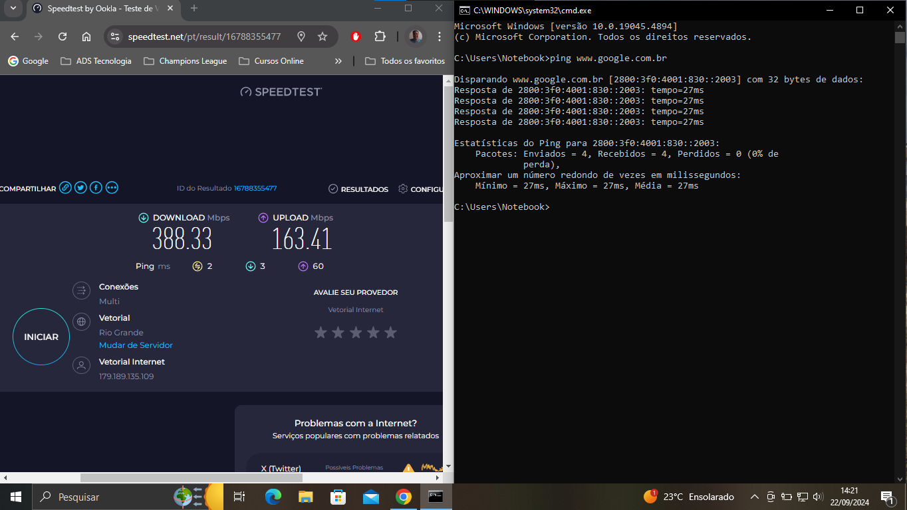
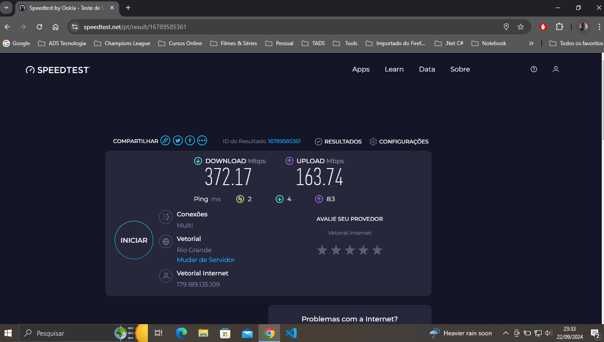
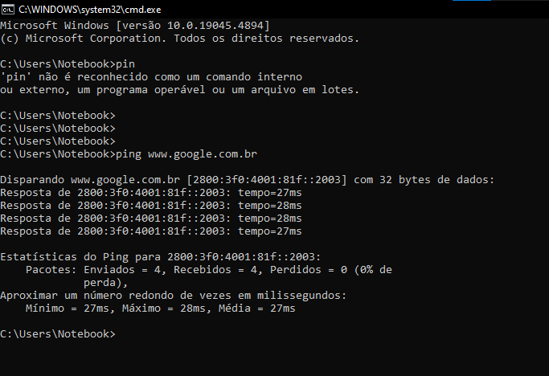
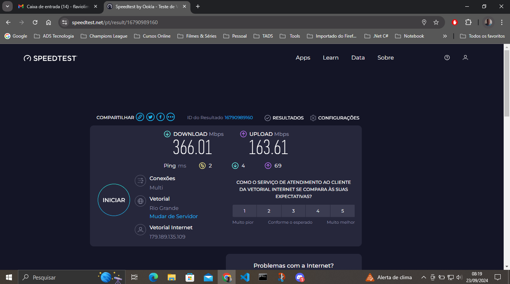
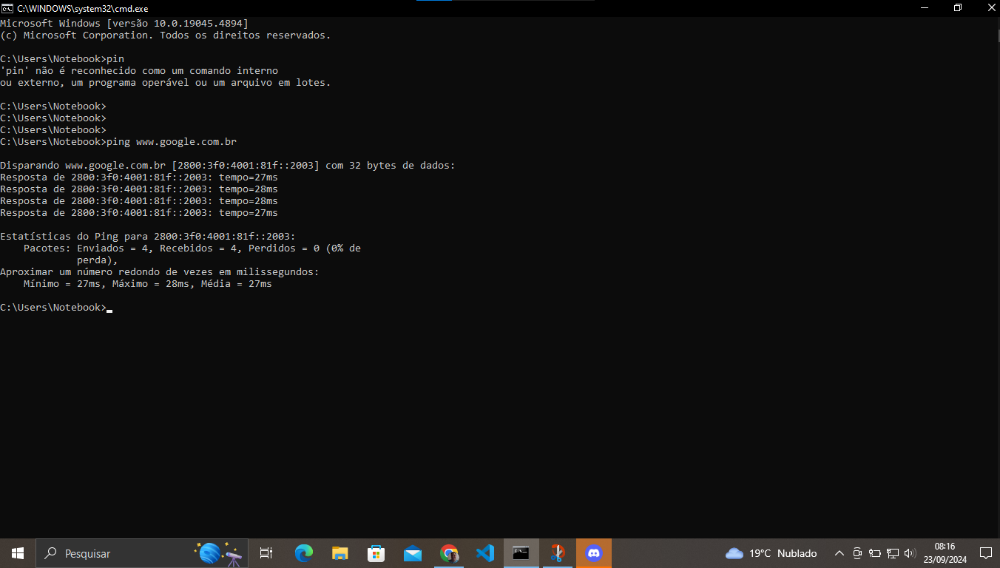

## TRABALHO DE REDES DE COMPUTADORES 

**Professor:** Luciano V. Gonçalves -
5º Semestre - **TADS** - **IFRS Campi Rio Grande**.

**Aluno:** Flávio de Medeiros Lima - **Matricula:** 2019012458
___

### Relatório de Avaliação de Desempenho da Rede Residencial

#### 1. Introdução
O presente relatório tem como objetivo avaliar o desempenho da rede residencial através de testes de velocidade de download e upload, bem como testes de ping para o site do Google. Esses testes foram realizados em três momentos diferentes do dia para capturar variações de desempenho em horários de pouca e alta carga e suas variações.

#### 2. Resultados dos Testes

#### 2.1 Dados de Contratação do Serviço 
Plano contratado: 360MB.
 

#### 2.2 Dados Coletados

Primeiro dia período da tarde: 22/09/2024 às 14:21 Medição de download, upload e ping (www.google.com.br).
 

Primeiro dia período da noite: 22/09/2024 às 23:33 Medição de download, upload.
 

Primeiro dia período da noite: 22/09/2024 às 23:33 Medição do ping (www.google.com.br).
 

Primeiro dia período da noite: 22/09/2024 às 23:33 Medição de download, upload.
 

Primeiro dia período da noite: 22/09/2024 às 23:33 Medição do ping (www.google.com.br).  
 

#### 2.3 Testes de Velocidade de Download e Upload 

| Data e Hora           | Download (Mbps) | Upload (Mbps) |
|-----------------------|-----------------|---------------|
| 22/09/2024 - 14:21    | 388,33          | 163,41        |
| 22/09/2024 - 23:33    | 372,17          | 163,74        | 
| 23/09/2024 - 08:19    | 366,01          | 163,61        |

#### 2.4 Testes de Ping (www.google.com.br)

| Data e Hora           | Pacotes Enviados | Pacotes Recebidos | Pacotes Perdidos (%) | Mínimo (ms) | Máximo (ms) | Média (ms) | 
|-----------------------|------------------|-------------------|----------------------|-------------|-------------|------------|
| 22/09/2024 - 14:21    | 4                | 4                 | 0%                   | 27          | 27          | 27         | 
| 22/09/2024 - 23:33    | 4                | 4                 | 0%                   | 28          | 29          | 28         |
| 23/09/2024 - 08:19    | 4                | 4                 | 0%                   | 27          | 28          | 27         | 

#### 3. Análise dos Resultados

#### 3.1 Variação de Velocidade de Download e Upload
Observou-se que a diferença entre as velocidades de download e upload nos momentos avaliados foi mínima, com uma leve redução na manhã do dia 23/09/2024. Essa variação de aproximadamente 22,32 Mbps no download e 0,33 Mbps no upload pode ser considerada insignificante, sugerindo que a rede está operando de forma estável, mesmo em horários de alta carga e que em todos os momentos o serviços entregue atende o plano contratado.

#### 3.2 Teste de Ping
Os testes de ping apresentaram tempos de resposta consistentes, com latências mínimas e médias variando entre 27 ms e 29 ms em ambos os horários. A ausência de perda de pacotes também indica um bom desempenho da conexão, o que significa que a rede está confiável para comunicação com servidores externos, mesmo em períodos de alta carga.

#### 4. Conclusão
Os resultados indicam que a rede residencial testada mantém um desempenho consistente, sem variações significativas entre os horários de baixa e alta carga. A estabilidade tanto nos testes de velocidade quanto nos testes de ping demonstra uma boa qualidade da conexão, com baixa latência e sem perda de pacotes. Isso sugere que a rede está adequadamente dimensionada para suportar as demandas de uso doméstico, mesmo durante horários de pico.

---

